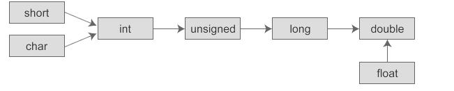

## java8api
https://docs.oracle.com/javase/8/docs/api/java/lang/Object.html#toString()

## 视频教程
https://www.bilibili.com/video/BV1qt411U7rq?p=164

## 环境变量
https://www.jianshu.com/p/463244ec27e3
vi ~/.bash_profile

JAVA_HOME='/Library/Java/JavaVirtualMachines/jdk1.8.0_111.jdk/Contents/Home'
export JAVA_HOME
export PATH=$JAVA_HOME/bin:$PATH

source ~/.bash_profile
echo $JAVA_HOME

============ 其他 ==========

## Java开发最容易踩的十个大坑
https://juejin.cn/post/6907093778797101070

## 自学JAVA的我提交给2020的问卷答案
https://juejin.cn/post/6906849942376513549

## Java 中的语法糖，真甜
https://juejin.cn/post/6903678103483072520

===== 代码格式 ======

## idea代码格式
/**
 * @Author Cracker
 * @Date ${DATE}
 */

============ io =============

## 键盘、文件、网络、数据库当做水资源，用户要取里面的数据就要建立流。输入流就是input,输入到内存中。输出流就是往硬盘中写。
http://baijiahao.baidu.com/s?id=1600444161351758219&wfr=spider&for=pc

#### 看完这个，Java IO从此不在难 
https://juejin.im/post/5b97e5f75188255c8d0fb0c0

## getInputStream与getOutputStream详解以及相互转换
https://blog.csdn.net/fjcsdn/article/details/80633660

## 断点下载会用到的类：RandomAccessFile
案例：xc-service-manage-media TestFile

## 谈谈Java流
https://juejin.cn/post/6907464274051301384

## 从零开始学习Java8 Stream
https://juejin.cn/post/6906622103827513351

====================== 集合 ==============

## 从面试角度分析ArrayList源码
https://juejin.cn/post/6906312498887327757

## 集合三兄弟List,Set,Map傻傻理不清？掌握诀窍面面俱到！
https://juejin.cn/post/6907591570380292110

## Java常用工具——集合
https://juejin.cn/post/6898955955656998920

## 如何决定使用 HashMap 还是 TreeMap？
https://juejin.cn/post/6904253144843485191

========== 基本类型 ===========

## 数据类型转换，遵循一个原则：

 byte short char int long float double 1 2 2 4 8 4 8

 范围小的转到范围大的自动进行转换，范围大的转为范围小的要进行强制类型转换

 例如黄种人肯定是人类，到人类却不一定是黄种人

 java中如果碰到char、byte和short参与运算时，会自动将这些值转换为int类型然后再进行运算

## 默认初始化，基本类型是 0  ，布尔类型是 false ，引用类型为null，char类型为null

## 自动类型转换遵循下面的规则：
1.若参与运算的数据类型不同，则先转换成同一类型，然后进行运算。
2.转换按数据长度增加的方向进行，以保证精度不降低。例如int型和long型运算时，先把int量转成long型后再进行运算。
3.所有的浮点运算都是以双精度进行的，即使仅含float单精度量运算的表达式，也要先转换成double型，再作运算。
4.char型和short型参与运算时，必须先转换成int型。
5.在赋值运算中，赋值号两边的数据类型不同时，需要把右边表达式的类型将转换为左边变量的类型。如果右边表达式的数据类型长度比左边长时，将丢失一部分数据，这样会降低精度。
下图表示了类型自动转换的规则：

## Java四种引用类型：强、软、弱、虚
https://juejin.cn/post/6907390435413458957

========== 数值计算 ==========

## 避免用Double来进行运算、BigDecimal你遇见过哪些坑？
https://juejin.cn/post/6906733547634032654
价格、大数计算用 BigDecimal
·

=========== 面向对象 ========

## 类的执行顺序
https://www.jianshu.com/p/54234c7ddd8f
去先执行static静态块、再执行构造方法、再执行成员变量

## 接口及抽象类
https://juejin.cn/post/6844903734263152654
https://blog.csdn.net/carson_ho/article/details/81214902
抽象类对一整个类事物进行抽象，接口对行为进行抽象

## 接口的方法默认是public可以不写
https://www.zhihu.com/question/55611246

## 定义用接口定义，实现用子类实现
List<Student> list = new ArrayList<>();

## 有参写了，无参也要写。有参没写，无参可以不用写，系统会默认给个。

## this的用法：构造函数中调用另一个构造函数

## 多态：父类的引用指向子类的实例

## main方法为什么不能访问成员变量
https://blog.csdn.net/qq_41383905/article/details/84591779

## 改变引用不改变物理结构，改变引用的成员变量改变物理结构

## 面试官：对象可能会迟到，但永远不会缺席
https://juejin.cn/post/6907160739224485902

## Java之面向对象的三大特征
https://juejin.cn/post/6898592881213669389

======= 序列化 =========

## Jackson：我是最牛掰的 Java JSON 解析器（有点虚）
https://juejin.cn/post/6906335012866490375

### Java基础之序列化篇
https://juejin.cn/post/6903437158431129614
序列化是将对象（内存中）的状态信息转换为可以存储或传输的形式的过程。	给对象赋一个标识，好辨别

## Java中实现序列化的两种方式
https://www.cnblogs.com/aigeileshei/p/5855823.html

======= String ======

## JNDI
https://blog.csdn.net/wn084/article/details/80729230

## 为什么javaBean要有一个公有的无参构造方法？
https://zhidao.baidu.com/question/237487023.html

## string
https://juejin.cn/post/6844903935401164808

## String 为什么是不可更改的
https://zhidao.baidu.com/question/437316401742936164.html

## JAVA中的属性和字段有什么区别
https://www.cnblogs.com/1225hkl/p/4413715.html

## 你真的懂 == 和 equals 的区别吗？
https://juejin.cn/post/6844903790089338887
==比较的都是地址，基本类型的值对应的地址是固定的。equals也是==，String的equals()方法强行改成了值比较。

## Integer和int的关系
https://juejin.cn/post/6844903829872312328

## 静态变量和实例变量的区别
https://www.cnblogs.com/hongten/archive/2013/03/02/hongten_static.html

## Comparator 和 Comparable 的比较与用法
https://juejin.cn/post/6844903928857886734

====== 泛型 ======

## 集合的泛型最好都要带上参数
List<Integer> list = new ArrayList<Integer>();

## Class<T>和 Class<?>类型 有什么区别
https://www.jianshu.com/p/fecafcc83fba

## JavaAPI 中 <E> 与 <T> 的含义	Java中泛型Class<T>用法
https://www.cnblogs.com/zhima-hu/p/7352555.html

======= java8 =======

## java return () -> {system.out.println("");}什么意思?
https://zhidao.baidu.com/question/501949257946302164.html

## 5分钟掌握java8 stream的常用开发技巧
https://juejin.cn/post/6904465203446939662

## 基础篇：JAVA.Stream函数，优雅的数据流操作
https://juejin.cn/post/6903331388825534477
去重

## 带你解惑大厂必会使用的 Stream流、方法引用
https://juejin.cn/post/6896614244385554446

====== jdk ====

## 面试再问 HashMap，求你把这篇文章发给他！
https://juejin.cn/post/6906791431495974919

======= 反射 =====

## 学会反射后，我被录取了（干货）
https://juejin.cn/post/6864324335654404104